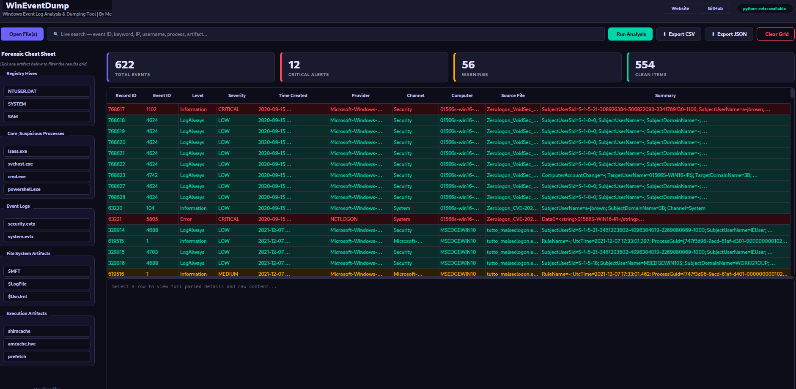

# WinEventDump

**Windows Event Log Analysis & Dumping Tool**

WinEventDump is a powerful, user-friendly forensic tool designed for analyzing and dumping Windows Event Logs (.evtx files) and other forensic artifacts. Built with a modern dark theme interface, it provides security professionals and forensic investigators with the tools they need to quickly triage, analyze, and export critical security events.




## Table of Contents

- [Features](#features)
- [Screenshot](#screenshot)
- [Installation](#installation)
- [Quick Start](#quick-start)
- [Usage Guide](#usage-guide)
- [Supported File Formats](#supported-file-formats)
- [Event Classification](#event-classification)
- [Use Cases](#use-cases)
- [Technical Details](#technical-details)
- [Contributing](#contributing)
- [License](#license)
- [Contact](#contact)

## Features

### Core Capabilities
- **EVTX File Parsing** - Full support for Windows Event Log format
- **Real-time Metrics** - Live counters for Total, Critical, Warning, and Clean events
- **Live Search** - Instant filtering across all event fields
- **Severity Classification** - Automatic classification of events (Critical/Medium/Low)
- **Multi-format Support** - Parse EVTX, CSV, JSON, TXT, and LOG files
- **Export Options** - Export to CSV or JSON formats


### Forensic Features
- **Artifact Detection** - Identify suspicious Windows artifacts
- **Smart Classification** - Keyword and Event ID based severity detection
- **Cheat Sheet Sidebar** - Quick access to common forensic artifacts
- **Detailed Event View** - Full event data and raw XML content
- **Background Processing** - Non-blocking file loading
- **Batch Processing** - Load multiple files simultaneously

### Security Features
- **Critical Event Detection** - Identify security threats automatically
- **Audit Log Monitoring** - Detect log tampering (Event ID 1102)
- **Account Activity Tracking** - Monitor user creation/deletion
- **Threat Hunting** - Find PowerShell abuse, suspicious processes
- **Trend Analysis** - Visual metrics for quick assessment

## Screenshot


*Main interface showing event analysis with severity metrics, search functionality, and detailed event view*

## Installation

### Prerequisites
- Python 3.6 or higher
- pip package manager
- Git (optional, for cloning)

### Required Dependencies
```bash
# Install PyQt6 (GUI framework)
pip install PyQt6

# Install python-evtx (Windows Event Log parser)
pip install python-evtx
